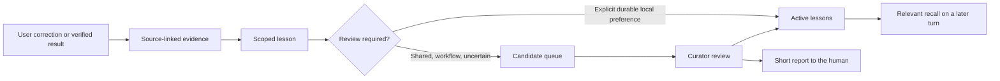

# Grok Bot Learning

Persistent, evidence-backed learning for a team of Grok bots on one shared computer.

Capture a correction, propose a scoped lesson, review it when needed, and retrieve it during later work. Inspect what changed and roll it back without throwing away the evidence.

This is an independent reference implementation, not an official Grok product. It adds a learning workflow alongside Grok's existing memory. It does not fine-tune a model or automatically rewrite bot roles.

## What is included

1. A Python/SQLite CLI for evidence, lessons, scoped recall, review, and checkpoints.
2. An explicit fleet configuration: IDs, curator, domains, protected bots, and opt-in global sharing.
3. A shared protocol and a twice-daily review routine that reports after every run.
4. Native integration manifests with original descriptions, exact proposed changes, and restoration instructions.
5. A synthetic demo, 46 acceptance tests, and GitHub Actions checks.

Runtime dependencies: **Python 3.10+ and SQLite with FTS5**. No pip packages, vector database, API key, or background server are required. Grok's normal model/tool usage still applies.



## Try it locally

```sh
git clone https://github.com/matthiasroder/grok-bot-learning.git
cd grok-bot-learning
python3 -m unittest discover -s tests -v
python3 examples/demo.py
```

The demo uses synthetic evidence in a temporary directory. It demonstrates that another bot cannot recall a domain lesson until review, then verifies that rollback preserves the evidence and disables recall. It does not connect to Grok or touch your bots.

## Install on your Grok computer

Use a terminal on the computer your Grok bots share, or an already-authorized SSH connection. The repo does not install or configure SSH. Grok documents its [shared computer](https://docs.x.ai/grok-bot/computer-and-apps) and [skills and routines](https://docs.x.ai/grok-bot/skills-routines-and-automations).

### 1. Identify the current fleet

```sh
python3 native.py discover --native-root /home/box/agent-data
```

The path above was observed in the original deployment. It is a configurable export location, **not a promised public API**. If it differs or is missing, inspect your environment with supported Grok tools. Do not guess IDs. A profile folder that appears later is adopted on the next `roster`, `init`, `record`, `learn`, or `session`. Folders that remain after a bot was deleted are not a reason to keep that bot: if the bot is not in config, list the id or exact profile name in `manifests/inactive-native-agents.json` and run `roster`. If the bot is already in config, set `active: false` instead.

Copy `examples/fleet.example.json` to a private `fleet.json`. Replace every synthetic ID and example name with your own bot's actual ID and name. Choose an existing curator. Configure the intended domains and your IANA time zone. Remove examples you do not need.

| Setting | Meaning |
| --- | --- |
| `active: false` | Exclude a bot even if its exported folder remains. |
| `domain: "software"` | Allow reviewed domain lessons to be proposed and recalled. Matching domains do not share bot-local memory. |
| `protected: true` | Keep lessons local and exclude candidates from the curator's queue. |
| `include_global: true` | Explicitly allow global lessons. Defaults to false; incompatible with protected mode. |
| `curator_id` | Active, non-protected bot that can review shared candidates. |
| `owner_name` | Name used in the profile block. Defaults to `the user`. |

Names have no hidden policy meaning. Two bots with different writing voices can have separate domains, and a creative persona can decline global work preferences.

### 2. Install disabled

Choose a new directory outside this checkout. The installer refuses to overwrite an existing installation.

```sh
python3 install.py --root /workspace/grok-learning --config ./fleet.json
/workspace/grok-learning/bin/agent-memory status
python3 /workspace/grok-learning/current/native.py prepare --root /workspace/grok-learning
```

Installation copies the runtime and rendered skill, registers every configured bot, adopts any other native profile that is not excluded or inactive, and creates a `pre-activation` database checkpoint. Preparation reads native profiles and saves exact originals. If a description already contains a shared-learning block, preparation replaces only the text between `[shared-learning:begin]` and `[shared-learning:end]`. Neither command changes Grok profiles or routines. The runtime stays disabled.

### 3. Apply the native integration

Follow [the deployment guide](docs/deployment.md), or use its copyable setup prompt. The files in `/workspace/grok-learning/manifests/` contain the exact changes.

Use **supported Grok profile and routine tools or UI**. Preserve original descriptions and every unrelated field. Never apply the manifests by overwriting internal JSON or databases. Some accounts/tool versions may not expose the same management operations; stop and report that limitation.

Save the rendered `current/SKILL.md` into the Grok Bot skill catalog under the name `shared-learning`, using the owner's UpdateState skill write. Keep that catalog entry the same as the canonical file. The profile block names the skill by that catalog name; a file on disk that is not in the catalog is not consulted. When the canonical skill changes, update the catalog in the same change.

Test restoration before enabling. A profile description that must be exactly empty can only be restored by the owning bot's own profile setter, because the sibling-agent update tool rejects empty or whitespace-only descriptions. Do not substitute a placeholder. In the original deployment, each bot's own setter accepted an empty string. Treat tool names as an observed compatibility detail, not a universal API guarantee.

### 4. Verify and enable

```sh
python3 /workspace/grok-learning/current/native.py verify --root /workspace/grok-learning
/workspace/grok-learning/bin/agent-memory enable
```

To replace an older shared-learning block inside a manifest that already exists, run this version's `native.py upgrade --root /path/to/existing-install`, then reapply the targets and update the catalog skill. Upgrade leaves baseline backups and native profiles untouched. Details are in [the deployment guide](docs/deployment.md).

Enable only after every configured profile is verified, native bot existence and the new routine are confirmed, unrelated fields are unchanged, and restoration has been tested. The file verifier exits nonzero on an incomplete integration. It cannot verify a server-kept routine or prove that a bot still exists in the app.

Ask the curator to perform a real evidence → candidate → review → recall check using a verified technical finding from setup. Do not insert synthetic preferences into your real learning store. Each other bot begins using the protocol on its next normal turn; a profile update is not proof that every bot has already followed it.

## Everyday commands

All CLI commands return JSON. `record` and `learn` read a JSON object from stdin. See the [command reference](docs/commands.md) and installed `current/SKILL.md` for payloads.

```sh
/workspace/grok-learning/bin/agent-memory session --agent YOUR_BOT_UUID --query 'draft the project update'
/workspace/grok-learning/bin/agent-memory queue --agent YOUR_CURATOR_UUID --limit 12
/workspace/grok-learning/bin/agent-memory roster
/workspace/grok-learning/bin/agent-memory status
/workspace/grok-learning/bin/agent-memory checkpoint before-change
/workspace/grok-learning/bin/agent-memory disable
/workspace/grok-learning/bin/agent-memory rollback pre-activation
```

`roster` reconciles before it lists. A bot created after the last sync is accepted by `record`, `learn`, and `session` when its `profile.json` is present and the id is not excluded or inactive. That adoption does not change the enable flag and does not write native profiles. Configured bots keep their domain, protected flag, and global opt-in.

`disable` stops recall and new learning writes. Database rollback restores prior lesson state, retains later events and revision history, and returns newer lessons to candidates. It leaves the runtime disabled. Exact native restoration is separate: use the saved restoration manifest through Grok's supported tools and pause the added routine.

## What the human sees

The configured review routine posts a short summary to the owner in the curator's chat after **every run**, including a run with 0 candidates: lessons activated or updated, affected bots/scopes, reviewed and pending counts, and failures when relevant. An empty review says “No new learning this run.” It does not wake sibling bots. Reports summarize that review, not every bot-local preference activated between runs.

## Limits to understand

Capture depends on bots following the protocol. There is no verified platform completion hook. A native memory save alone does not count as recording: the profile block tells the bot to run `record` in the same turn as a correction or an explicit learn, remember, always, never, or stop instruction. Scheduled reviews only consolidate candidates that were recorded. Historical transcript import is opt-in and treats exports as dated evidence, not current human instructions.

Scope checks are retrieval policy, **not a security boundary**. The bots share an OS account, and the CLI's agent ID is supplied by its caller. A bot with shell access could read the database directly or impersonate another ID. Source provenance is recorded, not cryptographically authenticated. Keyword checks for permission-related text and common secret patterns are incomplete heuristics.

Retrieval uses lexical FTS5 search and a small fallback of recent local preferences. It can miss relevant lessons. A curator is also a model and can misjudge evidence. Keep consequential facts in their authoritative source systems, inspect the reports, and preserve existing approval rules. See [architecture and trust](docs/architecture.md).

Checkpoints live on the same computer. Arrange your own periodic off-machine backup of evidence and configuration; none is installed automatically. Do not commit personal config, native snapshots, transcripts, or databases to GitHub.

## Origin and license

Extracted from a working deployment across 23 Grok bots in September 2026. That deployment passed 25 runtime tests and a real learning roundtrip. This configurable release has additional installation and policy tests. These checks verify mechanisms; they do not establish long-term improvement in bot quality.

MIT licensed. [Matthias Röder](https://matthiasroder.com). Contributions should use synthetic fixtures and include an observable acceptance check for behavioral changes.
